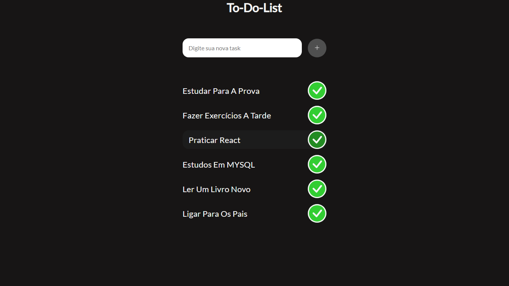

# Projeto lista de Tarefas

## Projeto inspirado no canal Gustavo Neitzke para desenvolvimento da lógica com Javascript puro.
---
## Ideias iniciais:
- Entender a lógica do projeto e aplicar pequenas melhorias.
- Uso de LocalStorage para armazenamento de dados
- Manipulação de elementos com Css
- Respostas dinâmicas utilizando um modal criado por mim a fim de praticar diferentes funções de resposta.
---
## Tecnologias Utilizadas:
- HTML
- CSS
- JAVASCRIPT